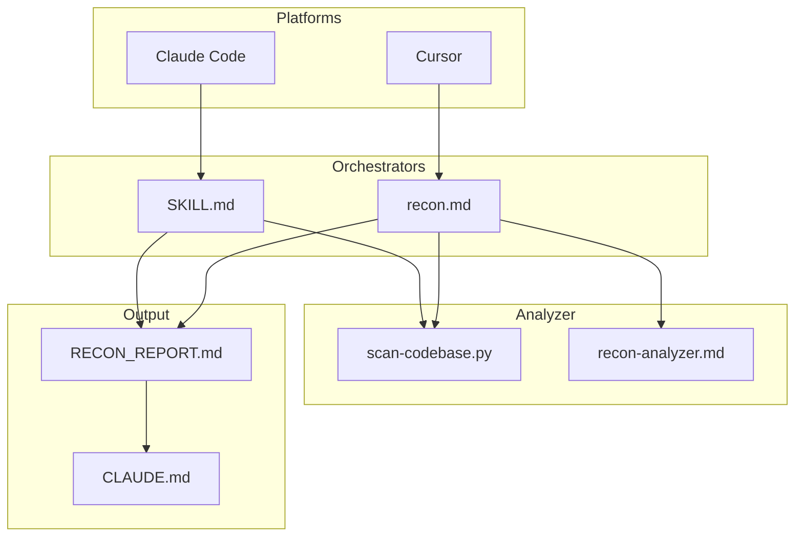

# Recon Report

> Auto-generated by Recon. Last mapped: 2026-02-04

## System Overview



Recon is a multi-platform codebase mapping tool that:
1. Runs a Python scanner to collect metadata (tokens, git stats, duplicates, entrypoints)
2. Spawns parallel AI subagents to analyze file groups
3. Synthesizes results into a persistent map (`docs/RECON_REPORT.md`)

**Platforms**: Claude Code (stable), Cursor (beta), Codex (planned)

## Entrypoints

| Entry | Type | Evidence |
|-------|------|----------|
| `plugins/recon/skills/recon/scripts/scan-codebase.py` | CLI script | Direct Python execution with argparse |
| `plugins/recon/skills/recon/SKILL.md` | Claude Code skill | Loaded by skill system via `${CLAUDE_PLUGIN_ROOT}` |
| `cursor/agents/recon.md` | Cursor agent | Loaded by Cursor agent system |

## Config Surface

| Category | Files |
|----------|-------|
| Claude Plugin | `.claude-plugin/marketplace.json`, `plugins/recon/.claude-plugin/plugin.json` |
| Git | `.gitignore` |
| Claude Local | `.claude/settings.local.json` |

## Environment Surface

| Variable | Used In | Required |
|----------|---------|----------|
| `CLAUDE_PLUGIN_ROOT` | plugins/recon/skills/recon/SKILL.md | Yes (Claude Code only) |

## Directory Structure

### Source Code
```
.
├── plugins/recon/                    # Claude Code plugin
│   ├── .claude-plugin/plugin.json    # Plugin metadata
│   ├── LICENSE                       # AGPL-3.0
│   ├── README.md                     # Plugin documentation
│   └── skills/recon/
│       ├── SKILL.md                  # Orchestrator instructions (6.2k tokens)
│       └── scripts/
│           └── scan-codebase.py      # Core scanner (9.9k tokens)
├── cursor/                           # Cursor integration
│   ├── LICENSE                       # AGPL-3.0
│   ├── README.md                     # Cursor documentation
│   └── agents/
│       ├── recon.md                  # Orchestrator agent (3.4k tokens)
│       └── recon-analyzer.md         # Analyzer subagent (1.4k tokens)
├── .claude-plugin/marketplace.json   # Marketplace listing
├── CLAUDE.md                         # Codebase summary
├── LICENSE                           # AGPL-3.0
└── README.md                         # Root documentation
```

## Module Guide

### Scanner (`plugins/recon/skills/recon/scripts/scan-codebase.py`)

**Purpose**: Core Python scanner that collects comprehensive codebase metadata

**Key exports**:
- `scan_directory()` - Main scanning function
- `detect_entrypoints()` - Finds entry points from configs and conventions
- `detect_config_surface()` - Detects config files by category
- `get_git_churn()` / `get_git_staleness()` / `get_git_cochange()` - Git intelligence
- `FileInfo`, `ScanResult`, `Entrypoint` - Data structures

**Dependencies**: `tiktoken`, `argparse`, `subprocess` (for git), `hashlib`, `json`

**Tokens**: 9,881

---

### Claude Code Orchestrator (`plugins/recon/skills/recon/SKILL.md`)

**Purpose**: Orchestrator instructions defining the 9-step Recon workflow for Claude Code

**Key sections**:
- Step 1: Check for existing map / force flag
- Step 2: Run scanner
- Step 3: Analyze scanner output
- Step 4: Plan subagent assignments
- Step 5: Spawn subagents
- Step 6: Synthesize reports / Build dependency graph
- Step 7-9: Write outputs

**Dependents**: Claude Code skill system

**Tokens**: 6,220

---

### Cursor Orchestrator (`cursor/agents/recon.md`)

**Purpose**: Cursor-native orchestrator mirroring SKILL.md for Cursor's subagent system

**Key differences from SKILL.md**:
- Uses relative scanner path (`./scripts/`) vs `${CLAUDE_PLUGIN_ROOT}`
- Uses `model: inherit` instead of explicit model
- No `--opus` flag support documented

**Dependents**: Cursor agent system, spawns `recon-analyzer.md`

**Tokens**: 3,445

---

### Cursor Analyzer (`cursor/agents/recon-analyzer.md`)

**Purpose**: Subagent that reads assigned files and produces structured analysis

**Key sections**:
- Part 1: File Analysis (purpose, exports, imports, patterns, gotchas)
- Part 2: Health Observations (complexity, duplication, inconsistencies)
- Part 3: Structured Facts (JSON dependency graph)

**Tokens**: 1,422

## Dependency Graph

### High Impact Files

Files central to the system - changes have wide blast radius.

| File | Role | Dependents |
|------|------|------------|
| `scan-codebase.py` | Core scanner | All orchestrators invoke via subprocess |
| `SKILL.md` | Claude Code orchestrator | Claude Code skill system |
| `recon.md` | Cursor orchestrator | Cursor agent system, recon-analyzer.md |

### Circular Dependencies

No circular dependencies detected.

### Orphan Candidates

| File | Confidence | Notes |
|------|------------|-------|
| `.claude/settings.local.json` | Medium | Local settings, not part of core flow |

## Conventions

**Naming**:
- Orchestrators: `SKILL.md` (Claude Code), `recon.md` (Cursor)
- Analyzers: `recon-analyzer.md` (Cursor), embedded in SKILL.md (Claude Code)
- Config: JSON in `.claude-plugin/` directories

**Patterns**:
- YAML frontmatter for skill/agent metadata
- Dataclasses for structured data in Python
- Mermaid diagrams for architecture visualization
- Step-by-step workflow instructions

**Model Selection**:
- Sonnet: Default for subagents (best cost/capability balance)
- Opus: Via `--opus` flag for higher quality analysis
- `model: fast` / `model: inherit` in Cursor agents

## Gotchas

**Scanner**:
- `tiktoken` must be installed or script exits with error
- Files over 1MB silently skipped
- Files over 50k tokens skipped
- Git commands have 30-second timeout
- `get_git_staleness()` can be expensive on large repos

**Orchestrators**:
- Never have Opus read codebase files directly - always delegate to subagents
- `--force` flag bypasses existing report check
- Cursor 2.4.x/2.5 has bug preventing subagent spawning

**Versions**:
- Scanner version (2.0.1) differs from plugin version (2.3.0)
- Keep `plugin.json` and `marketplace.json` versions in sync

## Health Summary

> Scanner metadata + subagent observations. Coverage: 12/15 files analyzed (80%)

### Hotspots

High churn files that may need attention:

| File | Commits (90d) | Notes |
|------|---------------|-------|
| README.md | 10 | Frequent documentation updates |
| SKILL.md | 5 | Active development |
| cursor/README.md | 5 | Active development |
| plugins/recon/README.md | 5 | Active development |

### Duplication

**Exact duplicates (scanner):**
- `LICENSE` = `cursor/LICENSE` = `plugins/recon/LICENSE` (7,285 tokens each)

**Semantic duplicates (subagent observations):**
- `SKILL.md` ↔ `cursor/agents/recon.md` — **80%+ identical content**
  - Both contain same 9-step workflow
  - Both contain same subagent prompt template
  - Both contain same report structure specification
  - Only differences: scanner path, model specification, `--opus` flag

- `README.md` ↔ `plugins/recon/README.md` ↔ `cursor/README.md` — Repeated feature lists

### Complexity

**Large functions (scanner):**
- `scan_directory()` (lines 865-1114) — **250 lines**, does 15+ distinct operations
  - Should be split into smaller functions

- `detect_entrypoints()` (lines 488-690) — **200+ lines** with repeated try/except patterns

- Nested `walk()` function (lines 920-1007) — 3 levels of nesting, mutates nonlocal variables

**Tech Debt:**
- 8 TODOs, 7 FIXMEs across codebase
- Highest density: `plugins/recon/skills/recon/scripts/` (5 items)

### Inconsistencies

**Scanner path**:
- SKILL.md: `${CLAUDE_PLUGIN_ROOT}/skills/recon/scripts/scan-codebase.py`
- cursor/agents/recon.md: `./scripts/scan-codebase.py`

**Model specification**:
- SKILL.md: Supports `--opus` flag
- cursor/agents/recon.md: No `--opus` support

**Version numbers**:
- Scanner: `2.0.1`
- Plugin/Marketplace: `2.3.0`

## Suggested First Actions

1. **Deduplicate SKILL.md and cursor/agents/recon.md** — 80%+ identical content creates maintenance burden. Consider extracting shared content or generating one from the other.

2. **Refactor `scan_directory()`** — 250-line function doing 15+ things. Extract into smaller, focused functions (e.g., `collect_files()`, `compute_git_stats()`, `build_result()`).

3. **Consolidate LICENSE files** — 3 identical copies (21k tokens total). Keep one at root, symlink or remove others.

4. **Align version numbers** — Scanner 2.0.1 vs Plugin 2.3.0 is confusing. Bump scanner version or document the versioning scheme.

5. **Add `--opus` flag to Cursor orchestrator** — Feature parity with Claude Code version.
